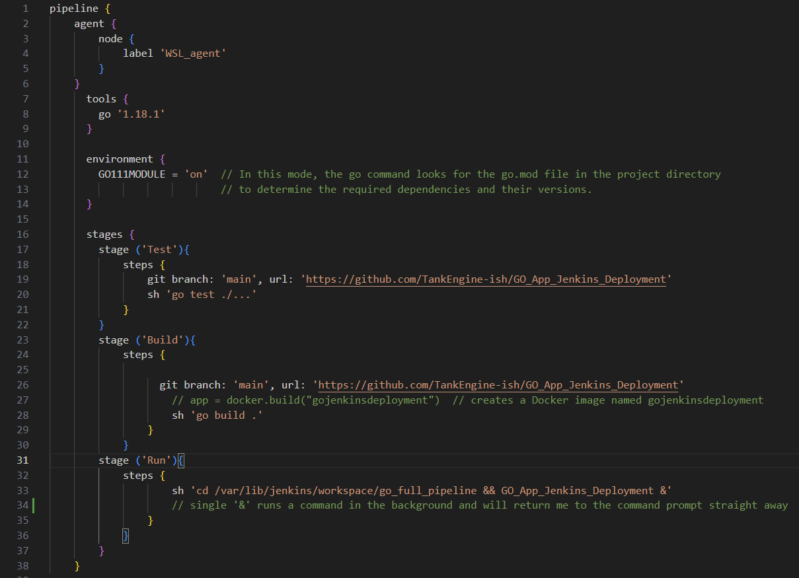

# GO_WebApp_Deployment

# Introduction

This simple web app was my first ever CI/CD Pipeline in Jenkins. It was a steep learning curve because I employed a lot of technologies,
plenty of plugins and a bit of my own personal ideas to make it all a bit more challenging.

# VIDEO

This is my second video for my sequence of DevOps projects in which I go through my process:

## System Set-Up

Once again I've decided to experiment from the get-go and installed Jenkins on a `WSL instance of Ubuntu` on top of my `Windows Homelab`.

## Jenkins Set-Up

* I installed openJDK 11 which is the open-source implementation of version 11 of the Java SE Platform.

* Then I added the Jenkins repo to my system and after that I had to import the GPG keys from the Jenkins site to verify the integrity of my packages.

* I followed up with actually installing Jenkins and getting a username and a password.

## Writing the Multi-Stage Pipeline

* I specified the Test, Build and Run stages which of course do not directly correspond to Dev, Stage and Run in a typical SDLC scenario but it's a start.

There are plenty of things in this file which I haven't yet gone over so let's dive right in.

## Configuring the version of Go

* In the Global Config Tool inside Jenkins I had to set the required version of Go. In the go.mod file it's 1.17 and on my system it's 1.18.1 so I tested it with the latter one and it worked.

## Configuring Docker

* Now this was a fun one. Getting the Jenkins file to build a docker image of your app on the WSL while only having it installed on the Windows.

* First up, I installed all the required docker plugins, then I exposed the docker daemon to the default 2375 port and added it to the .bashrc file on my WSL. Unfortunately the build failed at the `app = docker.build("gojenkinsdeployment")` stage. The Docker couldn't connect to the port. 

**So, what I had to do is manually forward that 2375 port using the `alpine/socat` docker image of the SOCAT port forwarder and moved it to 23750. You must do that step from your Powershell command, though, as it won't recognize the 2375 port from your WSL.**
`docker run -d --restart=always -p 127.0.0.1:23750:2375 -v /var/run/docker.sock:/var/run/docker.sock  alpine/socat  tcp-listen:2375,fork,reuseaddr unix-connect:/var/run/docker.sock` 
The above line starts a container with Alpine Linux and SOCAT, exposing the Docker API on port 23750 of the host system and allowing Docker client commands to communicate with the Docker daemon running inside the container.

* Next up I added the Jenkins user to the docker group with `sudo usermod -aG docker jenkins`, then I restarted Jenkins and the step was a success.

## Getting Blue Ocean

Blue Ocean is a plugin that modernizes the UI of the pipeline interface.

## Build Agent Set-Up

# Other important things I've learned

- Artifacts in Jenkins
- The potential of using Prometheus for monitoring the pipelines
- The purpose of incremental builds to build only the necessary parts of a project
- The difference between polling and push webhooks in doing a build
- The importance of Authentication (security realm) and Authorization (permissions) and configuring Matrix-Based Authorization Strategies